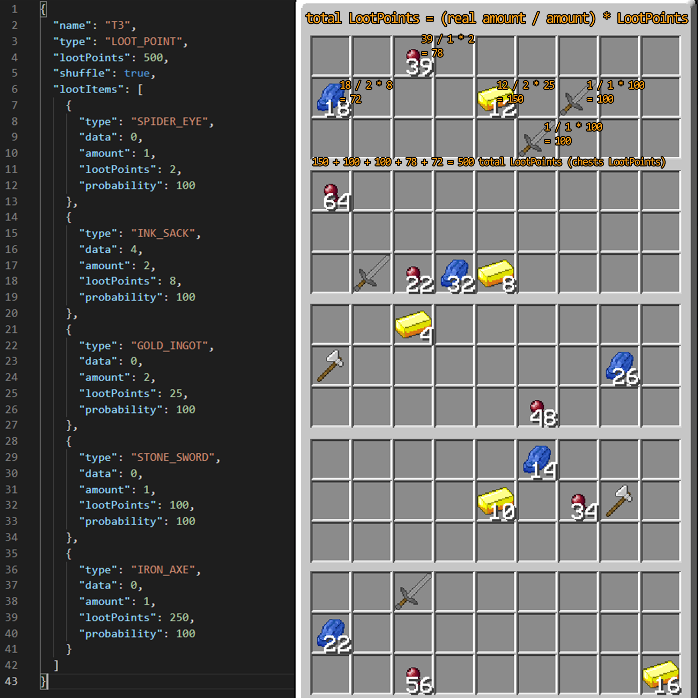

# CustomLootChest
Minecraft Plugin to easily generate Chests with custom Loot

This is my first plugin, and my first use of GitHub, so don't expect top level code. :D

I want to learn from this, so it would be nice if you leave some feedback!

## bStats
This plugin uses bStats which collects metrics about the server its running on.

To opt out, edit the `/plugins/bstats/config.yml` in your server folder.

[Dashboard](https://bstats.org/plugin/bukkit/CustomLootChest/10538)

## Usage
### Commands
- `/lootchest create [name]`  Saves the chest you look at as LootChest with the given name
- `/lootchest load [name]`  Loads the LootChest with the given name into the chest you look at
- `/lootchest delete [name]`  Deletes the LootChest with the given name

### Saved LootChests
LootChests are saved as `.json` files in this directory (`/plugins/CustomLootChest/savedChests`)  in your server folder.

You can edit these to change various parameters such as the probability that an item will appear in a chest or
whether the positions of the items are shuffled.

A saved LootChest may look like this (obviously) without the comments on the right:

```
{
    "name": "example",              The name of the LootChest, don't change this
    "type": "LOOT_POINT",           The type of the LootChest / the generation method used, 
                                    currently implemented: "DEFAULT", "LOOT_POINT"
    "lootPoints": 150,              The LootPoints of the LootChest, use for the "LOOT_POINT" type
    "shuffle": true,                enables / disables shuffling of items - default: false
    "lootItems": [
        {
            "type": "INK_SACK",     Name of the item as in org.bukkit.material
            "data": 4,              Data of the item, used for item variants like wool colors
                                    INK_SACK with a data of 4 equals dye:4 in Minecraft
                                    which is the ID for Lapis Lazuli
            "amount": 1,            Amount of the ItemStack
            "lootPoints": 50,       #LOOT_POINT     The LootPoints required for this item to generate                       
            "probability": 20       #DEFAULT        The probability with which the item can generate
                                    in percent - default: 100
        },
        {
            "type": "GOLD_INGOT",   Another item for example
            "data": 0,              Gold Ingots have no variants so data is 0
            "amount": 3,            An amount of 3 results in 3 gold ingots generating in the chest
            "lootPoints": 20,       #LOOT_POINT     20 LootPoints required
            "probability": 50       #DEFAULT        Probability of 50%
        }
    ]    
}
```
`#DEFAULT` this variable is only used for the LootChestType `DEFAULT`
`#LOOT_POINT` this variable is only used for the LootChestType `LOOT_POINT`

###Generation Methods
####Default
The `DEFAULT` generation iterates once through the List of LootItems.
The item will appear in the generated chest with the specified amount and under the specified percentage.

####Loot Point
The `LOOT_POINT` generation iterates through the List of LootItems as long as there are spare LootPoints.
The chance for the item to appear in an iteration is `1/LootPoints` percent in decimal (0.1 = 10%).

If the item "is lucky", and the generation is executed then the amount of LootPoints
the item has is subtracted from the chest's LootPoints, and the item is added to the chest's inventory.

An item will be unable to generate if the amount of spare LootPoints is less than the LootPoints required for the item.
The generation of the LootChest is finished when the spare LootPoints of the chest are less than
the smallest number of LootPoints of an item or zero.

#####Example


## To-Do
- [x] Adding Code Structure and committing the Project to GitHub
- [x] Get the Plugin running!
- [x] Save Loot-Sets
- [x] Fill Chests with Loot-Sets
- [x] Make a configurable Randomizer
- [ ] Maybe add a GUI
